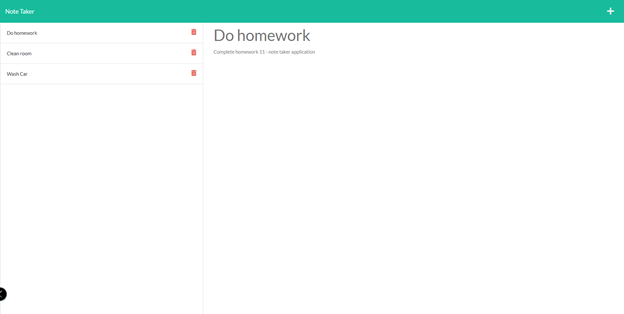

# 11-Note-Taker

## Project Description

This week's assignment required that I build the backend and routing for an application that enables the user to record notes in a db.json file. The user is able to save new notes, view previously recorded ones and delete notes from that list. This application is accessible on Heroku!

## Technologies Used:

HTML, CSS, Javascript, Express.js, cLog.js, uuid4 package and bootstrap

## Link to application on Github:

https://github.com/micah41224/11-Note-Taker

## Link to deployed application:

## Screenshots

## License:

The MIT License (MIT)

Copyright (c) 2021 Michael Feldman

Permission is hereby granted, free of charge, to any person obtaining a copy of this software and associated documentation files (the "Software"), to deal in the Software without restriction, including without limitation the rights to use, copy, modify, merge, publish, distribute, sublicense, and/or sell copies of the Software, and to permit persons to whom the Software is furnished to do so, subject to the following conditions:

The above copyright notice and this permission notice shall be included in all copies or substantial portions of the Software.

THE SOFTWARE IS PROVIDED "AS IS", WITHOUT WARRANTY OF ANY KIND, EXPRESS OR IMPLIED, INCLUDING BUT NOT LIMITED TO THE WARRANTIES OF MERCHANTABILITY, FITNESS FOR A PARTICULAR PURPOSE AND NONINFRINGEMENT. IN NO EVENT SHALL THE AUTHORS OR COPYRIGHT HOLDERS BE LIABLE FOR ANY CLAIM, DAMAGES OR OTHER LIABILITY, WHETHER IN AN ACTION OF CONTRACT, TORT OR OTHERWISE, ARISING FROM, OUT OF OR IN CONNECTION WITH THE SOFTWARE OR THE USE OR OTHER DEALINGS IN THE SOFTWARE.

## Contact Information:

Developer - Michael Feldman

Email - micah41224@gmail.com
